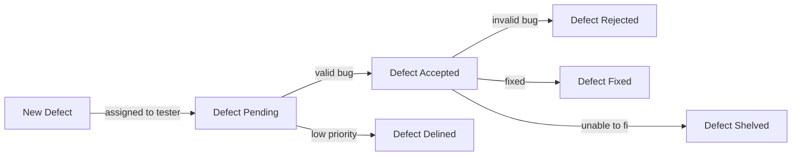
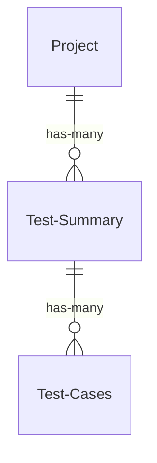

# Bug Catcher

You will be building and testing a bug reporting and test documentation framework for a company of your choosing. The company should be fictious and fun. Examples, Weyland Utani, Wayne Enterprises, Stark Industries etc.... The backend API is already constructed for you. You will build the UI and write the automation tests for it. You will be given high level user stories. You must break these down into smaller User Stories where necessary and then into Acceptance Criteria.

## Key Terminology
- **Project**
  - A software application of the company
  - Examples
    - Employee paid time off Scheduler
    - Helicopter Navigation System
- **Minimum Viable Product**
    - a phrase used to describe a project that has the minimum amount of features and functionality applied to satisfy the product owner for the current sprint
- **Acceptance Criteria**
    - step-by-step instructions for completing a user story
        - typically written using Gherkin syntax
- **Gherkin**
    - a specific syntax used to write uniform acceptance criteria
    - works well with testing frameworks for turing the acceptance criteria into executable code for tests
- **Wireframe**
    - a basic visualization of the UI you intend on creating. It should have basic explanations for how the different elements interact with each other

## Sprint backlog
The following user stories have been assigned to you for this sprint: you should consider each of these user stories as an MVP (minimum viable product) requirement and so you should focus your efforts on implementing these user stories before anything else in the product backlog.

### Managers
|As A| I Want to| So That|
|----|----------|--------|
|Manager| Sign in | I can view my custom home page| 
|Manager| Create Defects | I can start addressing them|
|Manager| Assign Defects | The defects can be worked on |
### Testers
|As A| I Want to| So That|
|----|----------|--------|
|Tester| Sign in | I can view my custom home page| 
|Tester| View defects assigned to me| I can begin working on them|
|Tester| Update Defects | I can monitor defect progress|

**Note** : the update defects user story will need to be broken down into more specific user stories, guided by the flowchart below. Others may need to be broken down as well.

## Bug Reporting
As this is a bug reporting system you are building the UI for, the categories and workflow of the reporting system has already been designed for you: you simply need to implement it (how you choose to implement this work flow has been left up to you). The reporting system should flow like below:

## Sprint Schedule
- **6/15/2022 Wednesday**
    - sprint starts
    - create wireframes
    - start writing acceptance criteria for user stories
        - break user stories into multiple, more focused user stories if necessary
    - start creating web pages(no JavaScript)
- **6/17/2022 Friday**
    - wireframes should be finished (any last minute changes added by this point)
    - acceptance criteria should be finalized
    - web pages should be finished
    - should start adding JavaScript to web pages by this point
- **6/22/2022 Wednesday**
    - JavaScript should be finished
    - Maven project should be set up and ready to be worked on by the end of the day
- **6/24/2022 Friday**
    - Junit and Cucumber should be part of the dependencies section of the project pom
    - page object models should be created and ready for use
    - driver should be chosen and added to the project
    - feature files should be written and added to the project
    - Work should have started on implementing acceptance criteria steps
- **6/29/2022 Wednesday**
    - Steps for every acceptance criteria should have been added to the project
    - Final debugging should be finished today
- **6/30/2022**
    - Code freeze should be implemented today
    - You should practice your presentation two or three times to hit your 5 minute mark.
    - Make sure your documentation is preppared 
- **7/1/2022**
    - Project presentations are today

## Recommended HTML Elements to Use
- input
- button
- table
    - thead
    - tbody
    - tr
    - th
    - td
- select or datalist
    - option
- header
- paragraph

## Product Backlog
This section includes all the remaining user stories associated with this project, and a diagram for how the content of the user stories should work together. Use it to decide upon stretch goals should you complete the sprint backlog before the end of the sprint.
### Testers
|As A| I Want to| So That|
|----|----------|--------|
|Tester| Create Projects | I can attach Test Summary Reports to them later|
|Tester| Create Test Summary Reports for a project | It is easy to see what testing has been done for a project|
|Tester| Create Test Cases  for a Test Report| I can document my testing |
|Tester | Delete a Test Case | I can remove accidental Entries|
|Tester | Finalize a Test Summary Report | Management can see what testing is complete|
