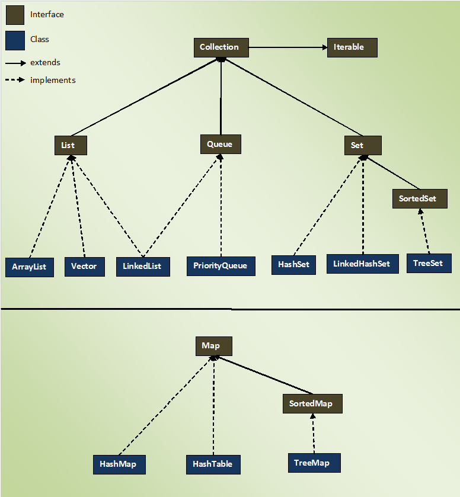
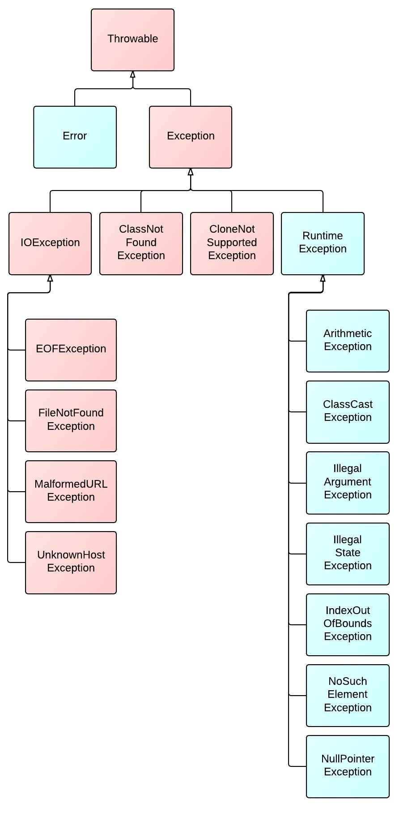

# Java Study Guide
## Java Basics
- high level
    - automatic memory management (no developer pointers, garbage collection handled for you)
- compiled
    - source code is all compiled together and then it can be run
- statically typed
    - must declare variable types
- strongly typed
    - can not coerce data types
- OOP
    - makes use of classes and objects
- Write Once, Run Anywhere
    - Anyone with a JRE and JVM can run a java app
- rich open source community
    - vast ammount of libraries you can add to your program
## Primitives
- boolean
- byte
- short
- char
- int
- float
- long
- double
## class/object
|class|object|
|-----|------|
|declared using class keyword| declared using new keyword|
|declared once|declared as many times as needed|
|no memory allocated when created|memory allocated when created|
|blueprint for creating objects|instatiated class|
```java
public class myClass {

}
// public = access modifier
// class = needed for class declaration
// myClass = name of class
```


## jdk, jre, jvm
- JVM
    - the jvm takes compiled java code and runs it.
- JRE
    - the jre contains the runtime libraries necessary for a java app to run, and it houses the jvm too
- JDK
    - the jdk contains developer tools (compiler, debuger, documentation tools, etc.) that allow for the creation of java apps
## pillars of oop
- Abstraction
    - you don't need to know why code works to be able to use it
- Polymorphism
    - objects can behave differently in different contexts
        - Overriding and Overloading are clear examples
        - Overriding happens when you take method from a parent and change its implementation in a child class
        - Overloading is where you have a method with the same name but different parameters that all do different things
- Inheritance
    - classes can acquire behaviors(methods) and attributes(fields) other than those defined in their class
        - child class can inherit variables and methods from parent
- Encapsulation
    - classes can protect their behaviors and attributes by making them private and designating specific means of interacting with their content
    - this provides a level of protection for the class: it prevents unintentional interaction with class data
## methods & parameters
```java
class myClass{
    public static void myBasicMethod(){
        System.out.println("This is where the code for the method goes");
    }
}
// public = access modifier
// static = non-access modifier keyword. Allows access to the method without instantiation
// void = return type. void indicates there is nothing to return
// myBasicMethod = name of the method
// () = any paramaters for the method are listed here
```
## Constructors
Constructors are special methods that determine how classes are to be instantiated as objects. They handle the build logic
```java
public class myClass{
    int myInt;
    String myString;

    // this is a basic "no args" constructor
    public myClass(){
        // every constructor calls super() (or this()) as its first line of code, whether you place it or not
    }

    // this is a constructor that only initializes one variable
    public myClass(int myInt){
        this.myInt = myInt;
    }

    // this is a constructor that initializes both variables
    public myClass(int myInt, String myString){
        this.myInt = myInt;
        this.myString = myString;
    }

    // this is a constructor that takes in an argument for one variable and sets a default for the other
    public myClass(String myString){
        this.myInt = 0;
        this.myString = myString;
    }
}
```
## Variable Scopes
1. Class/static scope
    - available to all instances of the class by invoking the class itself
    - the static keyword makes a variable class scope
    - class scope methods/variables can not interact with instance variables/methods
2. Instance/object scope
    - available to the instance of an object
    - this keword is used to interact with an instance variable
    - instace variables do not cross objects: they are unique per object
3. Method scope
    - available within the method it is instantiated in
    - the variable no longer exists after the method is finished, so it can not be used outside the method
4. Block scope
    - available within the {} it is instantated in
    - usually your controlflow statements
``` java
public class myClass{

    static int classCount = 0; // class scope: available to all myClass objects
    String objectName; // instance scope: each object of this class will have their own objectName field

    public myClass(String objectName){
        int addOnetoClass = 1; // method scope: only available within this method
        myClass.classCount += addOneToClass;
        this.objectName = objectName;
    }

    public static void countClass(){
        if (myClass.classCount > 0){
            System.out.println(myClass.classCount);
        } else {
            int zero = 0; //block scope: only exists here in the code
            System.out.println(zero);
        }
    }
}
```
## access modifiers
|modifier|access|
|-------|-------|
|public|anywhere|
|protected|within same package and sub-classes|
|default (no keyword)|within same package|
|private|within same class|
## packages & imports
packages are a way of organizing our java code. The naming convention is to write a reverse web domain seperating words with periods:
```java 
package com.suminski.mypackage;
```
classes can be referenced anywhere in your program by either using their "fully qualified name" or by importing them.
``` java
// you use the import keyword to import from another package or class
import packagename.classname

// fully qualified class names include the package
packagename.classname.method()
```
## Collection API

## Generics
Generics are used when you know the type something will be, but not the specifics. <> are used to indicate a generic. Generics provide type security with collection data types
```java
// the generic type goes inside the <> notation, lets the program know what type to expect
List<type> listName = new ArrayList<>(); // used to have to include type on right side, not so in Java 8
```
## Lists
- preserves order of entry
- indexable
- duplicates allowed
```java
// ArrayLists are arrays that can dynamically resize. Fast searching, slow adding
List<Integer> arrayList = new ArrayList<>();

// LinkedLists implement List and Queue. Composed of nodes that reference the next/previous node (double linked). Fast adding, slow searching
List<Integer> linkedList = new LinkedList<>();

/*
    The main methods you will use for Lists are the following:
    add():      this will add an object into the List
    get():      this will return the object stored at the index position given
                    NOTE: trying to access an index position that does not exist will crash your code
    remove():   this will remove the object provided as an argument from the List
    size():     this will return the size of the List(# of elements in the list)
*/
```
## Sets
- does not maintain order
- unique elements only
- not indexable
```java
// HashSets are backed by HashMap, fast insertion and search. Not indexable
Set<String> hashSet = new HashSet<>();

// TreeSets maintain order. insertion and removal is slow because of ordering. No null allowed
Set<String> treeSet = new TreeSet<>();

/*
    The main methods you will use for Sets are:
    add():      this will add an element to the Set
    contains(): this will return true if an element is inside of the Set
    remove():   this will remove an element from the Set
    addAll():   this will add all the unique elements from a collection to the Set
*/
```

## Non-Access Modifiers
Java includes some keywords that are not used to denote access levels: these three are the most common ones you will interact with in training
- static
    - marks the method/variable as part of the class scope
- final
    - makes a variable unable to be reassigned a new value
    - makes a method incapable of being overridden
    - makes a class incapable of being extended
- abstract
    - makes a class incapable of being instantiated
    - marks a method as being defined without any implementation, which must be handled somewhere else

There are other keywords as well, but we will not make much (if any) use of them:
- synchronized 
    - relevant to threads and preventing deadlock phenomena
- transient 
    - marks a variable as non-serializable, meaning it will not be persisted when written to a byte stream

## Interfaces & Abstract Classes
Interfaces are like "contracts" that give classes access to the variables and methods they contain: their methods default to public abstract, but interfaces can hold static methods, along with pre-defined methods that are inteded to be overwritten. Abstract classes work like regular classes execpt they can't be instantiated

Key differences between abstract classes and interfaces:
|Abstract|Interface|
|--------|---------|
|class can't be instantiated|contract can't be instantiated|
|instance variable/access modifiers|public static final variables|
|concrete methods allowed|abstract methods normally(default/static allowed)|
|can only inherit one class|can implement multiple interfaces|

## Functional Interfaces and Lambdas
Functional Interfaces are interfaces with a single method that is used to create lambda templates.
```java
@FunctionalInterface // the annotation informs the compiler the interface is a functional interface
interface MyFunctionalInterface{
    // this is the abstract method we will use as our lambda template
    int mathematics(int num);
}
```
Lambdas are a way to do functional programing in Java (sorta). Instead of tying a method to a class it (sorta) stands alone. You can call lambdas without needing to also call a class. Collections have a built in system for a lambda: the forEach() method
```java
List<String> names = new ArrayList<>();
names.add("Billy");
names.add("Bob");
names.add("Jill");
names.forEach(name -> System.out.println(name)); // notice name requires no type declaration
```
you can also create your own lambdas by creating functional interfaces and implementing their single abstract method
```java
@FunctionalInterface
interface MyFunctionalInterface{
    int mathematics(int num);
}
MyFunctionalInterface addFive = num -> num + 5;
System.out.println(addFive.mathematics(5)); // this will print 10
MyFunctionalInterface subtractFive = num -> num - 5;
System.out.println(subtractFive.mathematics(5)); // this will print 0
```
## Exception hierarchy

## Exception Handling/Declaring
java throws exceptions when they occure. If no code is provided to handle the exception it will go all the way to the JVM and the JVM will terminate the program. You can handle exceptions as the developer by using try/catch blocks, similar to if/else blocks. This is called handling. You can also "duck" or declare exceptions by adding a throws clause to your method signature. This allows you to throw checked exceptions without catching it in the method
```java
// try to be specific with exceptions when possible
public static void duckMethod() throws Exception{

}
```
## Custom Exceptions
You can create custom exceptions relatively easily. Create a class, extend either exception or runtime exception (or a more specific exception) add a constructor that has a message parameter, and in the constructor call super(argument). You're done
```java
class MyCheckedException extends Exception{
    public MyCheckedException(String message){
        super(message);
    }
}
class MyUncheckedException extends RuntimeException{
    public MyUncheckedException(String message){
        super(message);
    }
}
```
## Checked vs Unchecked Exceptions
checked exceptions need to be in try catch blocks, unchecked do not. If you add throws to a method signature you can list any checked exceptions and throw them without a try catch block.
```java
try{
    throw new MyCheckedException("this message shows when the exception is thrown");
} catch (MyCheckedException exception){
    exception.printStackTrace();
}

if (2 > 1){
    throw new MyUncheckedException("you don't need to handle this with a try catch");
}

public static void throwsMethod() throws MyCheckedException{
    throw new MyCheckedException("I can do this without a try catch block");
}
```

## String API
Strings are immutable objects in Java. They have a pool (string pool) in the heap that allows for multiple references to point to the same String object. This makes them work a little differently from other objects
```java
// these two strings point to the same object in memory, return true when the .equals() method is called
String myString = "this is a valid way of declaring a string";
String myStringTwo = "this is a valid way of declaring a string";
System.out.println(myString.equals(myStringTwo)); // returns true

// using the new keyword will create a new instance of the string in the pool
String myString = "this is a valid way of declaring a string";
String myStringTwo = new String("this is a valid way of declaring a string");
System.out.println(myString.equals(myStringTwo)); // returns true, compares content
System.out.println(myString == myStringTwo);// returns false, compares memory location of objects 
```

## Wrapper Classes
Wrapper classes are the object versions of primatives. There are methods that require the use of objects for them to function, these wrapper classes allow primitives to be passed in as arguments. Java can handle much of this logic for you:

Autoboxing
- Java's automatic conversion of a primative to an object, or vice versa

Boxing
- converting a primitive to a wrapper class

Unboxing
- converting a wrapper class to a primitive
```java
public static void main(String[] args){
    int x = 5;
    needObject(x)// will print 10, x will be autoboxed into its wrapper class
}
public static void needObject(Integer num){
    System.out.print(num + 5);
}
```
