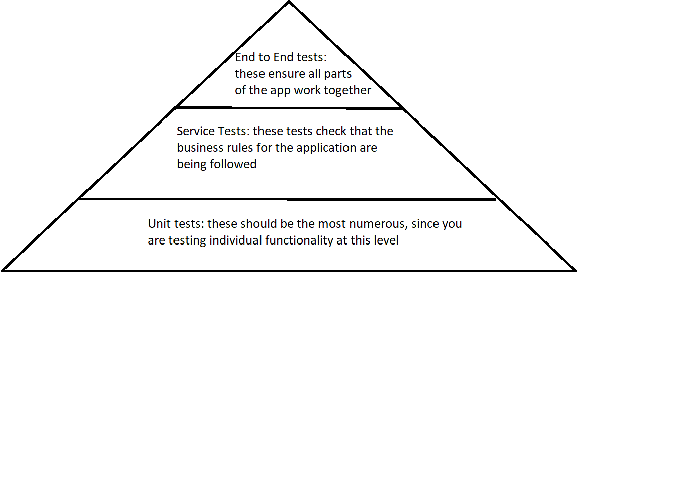
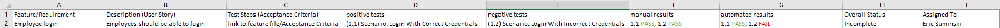
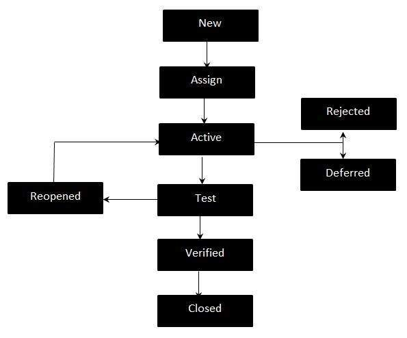

# Testing Fundamentals
### Why Testing?
Software testing is a neccessary part of any software development: you have to verify that your code does what you want it to do. This is where testing comes in: testing is the process of checking whethere your code does what it is supposed to or not. Historically this has been handled by manual testers: someone would boot up the software and manually try all the different features of the application, reporting whether they worked as intended or not. Sometimes this practice is still used, especially when the use-case of the software is more subjective (think videogames: oftentimes you need manual testers to thoroughly check the systems of the game). In most cases though, the software will have specificly intended outcomes that ought to be consistent (a calculator should always return 5 when 2 is added to 3). In these consistent cases, manual testing has made way for automation testing.

### Automation Testing
Automation testing is the practice of writing code that automatically handles the testing of software for you. So, instead of needing to pay someone to interact with your software, you simply write some code to test it for you. For a small application it may seem like a lot of work for little payoff, but the benefits of writing automation tests for applications scales exponentially the larger the application is (and therefore, the more code there is that needs testing). This is where automation testing shines: software can test and confirm our code is working properly (or confirm that it isn't) exponentially faster than a human can, no matter how good they are. 

### Testing Pyramid
The testing pyramid is a way of understanding what basic kinds of tests should be created, and how numerous they should be. According to the pyramid, the majority of your tests should be unit tests, followed by service tests, and the minority of tests (but still important) should be End to End tests


### Unit Testing
Unit testing is the lowest level of testing you can do: you take a single piece of the application's code logic and test it in isolation. take the following method:
```Java
public static String isEven(int num){
    if(num % 2 == 0){
        return "Even";
    } else {
        return "Odd";
    }
}
```
to thoroughly test this method you would need two unit tests: one to confirm that "Even" is returned when an even number is passed into the function, and one to confirm that "Odd" is returned when an odd number is passed as the argument. Note that the tests are not concerened with whether the Java code itself works (the key words and operators): we can assume them to be working as intended. Instead, the unit tests are checking the logic of the code WE have written (did I use the CORRECT operators, control flow statements, and paramaters/arguments?).
```Java
// unit tests to confirm isEven() method is working correctly
@Test
public void checkEvenReturn(){
    String result = isEven(2);
    Assert.assertEquals("Even", result);
}

@Test
public void checkOddReturn(){
    String result = isEven(3);
    Assert.assertEquals("Odd", result);
}


```

### Service Testing
If unit tests check that our code logic is correct, then Service tests confirm if we have correctly handled the required **Business rules** of the application. These are restrictions/requirements that have nothing to do inherently with the code, but do help determine what an application should and should not be able to do. For instance, let's say that the product owner of the method above does not want his application to work with the number 0: there is nothing programatically speaking that prevents the method above from working with the number 0, but because the product owner has asked for this to be included as a business rule we must accomodate. This would typically be handled by a second class, whose only job is to validate that business logic is being handled. The method used to validate the business logic would take in the same input as the method above, but would check what number it is instead of doing math:
```Java
public static String validateIsEvenInput(int num){
    if (num == 0){
        return "this method does not allow you to enter the number 0: please try again";
    } else {
        return isEven(num);
    }
}
```
The test for this would look similar to the tests for the isEven method: provide the method with the number 0, confirm if the error string is returned or not. The difference between this kind of test and the unit tests described above is WHAT is being tested: Unit tests check if your **code logic** is correct, Service tests check if your **Business logic** is correct. NOTE: the colloquial way of describe both Unit and Service testing is to call them unit tests: both tests technically check part of your code in isolation, but the goal of the testing is different. Programmers should never be allowed to name things.
```Java
// service tests to confirm 0 is not being passed to the isEven() method

@Test
public void noZeroAllowed(){
    String result = validateIsEvenInput(0);
    Assert.assertEquals("this method does not allow you to enter the number 0: please try again", result);
}
```

To compare the two:
|Service Testing|Unit Testing|
|---------------|------------|
|checks a piece of functionality in isolation|checks a piece of functionality in isolation|
|validates whether or not business logic is implemented correctly|validates whether or not coding logic is implemented correctly|

### End to End Testing
E2E testing is all encompasing: it takes the entirety of your application and validates whether everything is working together as intended or not. In web development this this typically accomplished through the use of Cucumber and Selenium: Cucumber turns acceptance criteria into executable code steps, Selenium provides a way of interacting with the web pages of the application. For these tests to pass all of the application must be working correctly. 

### Kinds of Tests

- Positive Test
    - these tests check that your code logic is correct
- Negative Test
    - these tests check that your business logic and common errors are handled correctly 
- White Box Testing
    - Testing done with access to the source code you are testing
- Black Box Testing
    - Testing done without access to the source code you are testing
- Regression Testing
    - Testing done to ensure that new features/additions to the code don't break 
- Retesting
    - Testing done after an initial test failed and refactoring is complete
- State Testing
    - Testing done to ensure that the content of the database you are using actually changes as intended
        - think testing Data Access Objects: does my create method ACTUALLY create something in the database?
- Behavior Testing
    - Testing done to ensure that the logic of your code actual works as intended
        - think testing Service Objects: does my validation method ACTUALLY prevent bad data from reaching the repository layer of my application?

### Common Testing Documentation
- Test Policy
    - This company wide document contains information that transcendes indivudal projects
    - information stored in this document has to do with everyon on every project
        - it explains how to report bugs
        - it explains how API endpoints should be created
        - it explains who has what role
        - etc.
- Test Plan
    - This project wide document contains information that is specific to the project it is attached to
        - explains what technologies are being used
        - deadlines
        - what is actually being developed/tested
        - other project specific info
- Test Case
    - This is an individual test
        - a collection of similar tests is called a Test Suite
        - a collection of test case reports is called a Test Report
- Requirements Traceability Matrix
    - this is a document that keeps track of the testing/development process
        - This document lists who is working on what
        - This document is also used to keep track of what has been accomplished
            - can be used to track bugs and blockers
            - can be used to see where a team member might need help so a team lead can send someone who finishes their work early to help the struggling team member
            - etc.
            
          

### Quality Aurrance vs Quality Control
These two topics both drive towards the same goal: a high level of functionality, efficiency, and good structure in an application. The difference between the two is that Assurance is a mindset that must be determined before the project is started, and Control is a reactive process that refines the application
- Quality Assurance
    - this is a proactive philosophy
        - How are we going to design the application in a way that includes quality gates and standards?
            - what are our coding standards?
                - All methods must have a comment explaining what they do
            - what are our testing standards?
                - every method must have a positive and negative test
            - what are our documentation standards?
                - all modules, classes, and methods must have a docstring
            - what are our development standards?
                - all github merges must be approved by a senior developer
- Quality Control
    - this is a reactive process
        - are there bugs that need to be fixed?
        - do reports need to be revamped?
        - do any methods need to be updated
        - have all features been added to the automated reports?
        - is a server down that needs to be rebooted?

### Testing Mindset
Having a testing mindset is something that you develop overtime. Writing a test to make sure the functinality is working as intended is easy: knowing EVERYTHING that could potentially go wrong and testing for it is far more difficult, and as you learn more about your application, systems you are using, and the peculiarities of the language you are writting with, you will find more comprehensive ways to write tests. This is not an arbitrary requirement companies give their testers: the more efficient your tests are, the greater scalability your app will have. The more comprehensive your tests are the easier it is to answer: "can we make our app do {thing}?" The more comprehensive your tests are the easier it is to immediately know what is and is not possible.

### Defect vs Feature
We all know what a feature is: it is some kind of functionality in our application. A defect can sometimes be a little trickier to determine: these are situations where your code does not work as intended, but it doesn't break your application. For instance, you might have a feature on a web page where clicking a button should create an alert with a success or failure message. Upon testing the feature though, instead of an alert being created a new paragraph element is added to the page with the message. The intended outcome of informing the user of the outcome of clicking the button is achieved, but in an unintended way. A few key words to be aware of:
- **Defect**
    - any feature which deviates from the expected result of an application or software's specification.
- **Bugs**
    - any faults that prevent a feature from working. These are typically found by unit tests
- **Errors**
    - any issues that prevent your code from compiling/running. Typically these issues must be handled before any testing is done
- **Failure**
    - An issue found by an end user after project deployment

There is a standard format for determining whether a defect needs to be "fixed" or not, called the Defect Life Cycle

#### Defect Life Cycle

1. New Defect
    - a defect is detected by tester
2. Defect Assigned
    - the defect is assigned to a development team member
3. Active Defect
    - Defects start in the active state: the development team will then investigate it to determine how to move forward with it. Active defects can either be initially rejected, deferred, or left in the active state
        - Defects can be rejected and changed to a closed status for multiple reasons
            - duplicate defect report
            - defect can't be reproduced
            - defect is determined to be a feature
        - Defects can be deferred for multiple reasons
            - the main reason will be a lack of time
4. Test Defect
    - Defects that are neither rejected or deferred wil be tested
        - the code in question should be tested using the same test/criteria that produced the defect in the first place
    - if the feature passes the test is closed and marked as verified
    - if the test fails then the defect is returned to the active status and will either be reassigned to a new developer, or the same developer will continue working on it

#### Defect Report Information
Defect reports will typically contain the following information
- Defect ID
- Feature/Scenario where the defect was identified
- test case where the defect was found
- defect description
- Environment
    - the operating system
    - browser used
    - version of software used
    - etc.
- Priority of the defect
- Severity of the defect
- Timestamp
- Tester who found the defect
- Devloper assigned to the defect
- Extra documentation references
- version of development build

#### Priority vs Severity
Severity and Priority are two different metrics for determining how much a defect/bug affects your product. Severity is a measurement of how much the defect affects one or more features, while priority measures how quickly the defect ought to be addressed. Usually the two go hand-in-hand (high priority == high severity) but this is not always the case.
- high priority low severity
    - your company landing page has a competitors' logo in place of your own
    - functionally, this does not affect your website. That being said, promoting your economic cometitor on your home page is not a great buisness move, so it should be fixed ASAP
- low priority high severity
    - your apps function to change names in the company database has completely broken
    - this would be annoying for those who are trying to fix or change their names in the database, but it does not break the ability for the app to do its intended job, so fixing something like the wrong logo on the landing page would be higher priority to fix first
